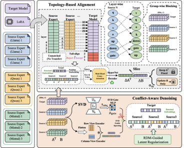

# HeteroFusion

**Can Heterogeneous Language Models Be Fused?**

Paper: [arXiv:2604.01674](https://arxiv.org/abs/2604.01674)

HeteroFusion is a research code release for adapter-space fusion across
heterogeneous language-model families. It learns structured updates for a
target LoRA adapter by reading one or more source LoRA adapters from different
backbones, aligning modules by layer topology, and optimizing the fused adapter
on lightweight replay data.

The current repository is a sanitized release: it contains the fusion code,
experiment configs, replay/evaluation utilities, figures, and small released
datasets. It does not include base model weights, LoRA adapter weights, training
outputs, logs, or private machine-specific artifacts.

<p align="center">
  
</p>

## What Is Included

- HeteroFusion entry point: `main.py`
- Fusion model, trainer, and regularizer: `src/model.py`, `src/trainer.py`,
  `src/losses.py`
- Dataset loader wrapper around the vendored LLaMA-Factory utilities: `data.py`
- GENOME 1+9 reproduction config:
  `configs/heterofusion/genome_1p9/llama_code_target_gemma9_sources.yaml`
- GENOME six-task validation/test data under `data/genome_tasks/`
- Generated GENOME mixed validation replay set under `data/genome_valid_mix_1p9/`
- Broader paper experiment configs under
  `configs/heterofusion/paper_experiments/`
- Sample replay data under `data/sample/`
- Helper scripts for GENOME replay construction, fusion, and evaluation
- README figures under `assets/`

## What Is Not Included

- Base model checkpoints
- PEFT LoRA adapter weights
- Fused/merged output adapters
- Optimizer states or trainer checkpoints
- Inference results, logs, caches, and local absolute paths
- The external GENOME evaluator repository

Adapters are intentionally absent. The `adapters/` directory is kept only as a
documented mount point; see `adapters/README.md` for the expected checkpoint
layout.

## Repository Layout

```text
HeteroFusion/
├── adapters/                         # Mount point for external LoRA adapters
├── assets/                           # Figures used in this README
├── configs/heterofusion/
│   ├── genome_1p9/                   # Sanitized GENOME 1+9 config
│   └── paper_experiments/            # Paper configs and ablation sweeps
├── data/
│   ├── genome_tasks/                 # Released GENOME valid/test task data
│   ├── genome_valid_mix_1p9/          # Generated six-task replay mix
│   └── sample/                       # Lightweight sample replay data
├── llamafactory/                     # Vendored utilities used by this release
├── src/                              # HeteroFusion transfer network/trainer
├── tools/                            # Dataset and GENOME evaluation helpers
├── data.py                           # Mixed-dataset builder
├── main.py                           # Fusion pipeline entry point
├── run_genome_heterofusion_1p9.sh     # End-to-end GENOME helper script
└── run_paper_*.sh                    # Paper experiment launch helpers
```

## Method Components In This Code

`HeteroFusionTransferNet` in `src/model.py` is the learnable transfer module. It
encodes LoRA `A` and `B` blocks, applies SVD-guided conflict-aware gating, uses
topology-aligned attention from target blocks to source blocks, and decodes
adapter deltas.

`HeteroFusionTrainer` in `src/trainer.py` loads target/source LoRA states,
aligns heterogeneous source layers to target layers with `tail`, `head`,
`uniform`, or `naive` strategies, dynamically patches predicted LoRA weights
into the target model during optimization, and exports a final PEFT adapter to
`merged_lora/`.

The supported update modes are:

- `b_only`: preserve target LoRA `A` and update `B`
- `a_only`: update target LoRA `A`
- `ab_joint`: update both target LoRA matrices

## Environment

This release is not packaged as a pip library. A practical starting environment
is:

```bash
conda create -n infer_train python=3.10 -y
conda activate infer_train
pip install --upgrade pip
pip install torch torchvision torchaudio
pip install transformers peft safetensors pyyaml fire tqdm numpy datasets accelerate sentencepiece scipy einops
```

The `run_genome_heterofusion_1p9.sh` script uses `conda run -n infer_train`.
Rename the environment in that script or create the environment with this name.

GENOME evaluation additionally expects a working vLLM-based GENOME evaluator
environment. Put that repository at `external/GENOME` or set `GENOME_ROOT`.

## Required External Paths

Set a base-model root:

```bash
export MODEL_ROOT=/path/to/base_models
```

The GENOME 1+9 config expects:

```text
${MODEL_ROOT}/llama-3.1-8b-instruct
```

Set an adapter root, or place adapters inside this repo's `adapters/` directory:

```bash
export ADAPTER_ROOT=/path/to/heterofusion_adapters
```

If `ADAPTER_ROOT` is unset, `main.py` resolves `${ADAPTER_ROOT}` to
`./adapters`.

Each adapter directory must contain a standard PEFT LoRA checkpoint:

```text
adapter_config.json
adapter_model.safetensors   # or adapter_model.bin
```

For the released GENOME 1+9 config, the required adapter layout is:

```text
${ADAPTER_ROOT}/
  llama3.1-8b-instruct/
    GENOME/
      code_alpaca_fast/
  gemma-2-2b-it/
    GENOME/
      cot/
      flan_v2/
      gpt4_alpaca/
      lima/
      oasst1/
      open_orca/
      science_literature/
      sharegpt/
      wizardlm/
```

## GENOME 1+9 Quick Start

Build or refresh the released six-task validation replay mix:

```bash
python tools/build_genome_valid_mix_dataset.py
```

Run HeteroFusion training for the GENOME 1+9 config:

```bash
python main.py configs/heterofusion/genome_1p9/llama_code_target_gemma9_sources.yaml
```

The fused adapter is written to:

```text
outputs/genome_1p9/llama_code_target_gemma9_sources/genome_1p9_valid_mix_tail_b_only/merged_lora/
```

To run the bundled end-to-end helper, including replay construction, training,
and six GENOME test evaluations:

```bash
export MODEL_ROOT=/path/to/base_models
export ADAPTER_ROOT=/path/to/heterofusion_adapters
export GENOME_ROOT=/path/to/GENOME
CUDA_VISIBLE_DEVICES=0 bash run_genome_heterofusion_1p9.sh
```

The script writes logs under `logs/genome_1p9/` and evaluation outputs under
`infer_results/GENOME_1P9_LLAMA_CODE_GEMMA9_TEST6/`.

## Running Other Paper Configs

The broader paper configs are available under:

```text
configs/heterofusion/paper_experiments/
```

They cover:

- single-source Qwen-to-Llama transfer
- multi-source cross-family fusion
- noisy-source robustness
- GLUE cross-family transfer
- alignment and update-mode ablations
- `alpha` and `mu_gate` sensitivity sweeps

Run any config with:

```bash
python main.py path/to/config.yaml
```

These configs use the same `${MODEL_ROOT}` and `${ADAPTER_ROOT}` convention.
Only the model and adapter paths referenced by the config you run are required.
Some paper configs also depend on the sample replay datasets in `data/sample/`.

The shell helpers are:

```bash
bash run_paper_single_source_qwen_to_llama.sh
bash run_paper_glue_cross_family.sh
bash run_paper_hyperparameter_sweep.sh
bash run_paper_main_ablation_qwen_to_llama.sh
```

Review each script before launching on a new machine, because GPU assignment,
environment names, output directories, and skip/dry-run behavior are controlled
inside the scripts and by environment variables.

## Full Model to HeteroFusion to Merged Model

The two checkpoint utilities under `tools/` support this end-to-end workflow:

```text
full fine-tuned model(s)
        |
        | tools/full_model_delta_to_lora.py
        v
target and source PEFT LoRA adapters
        |
        | main.py + a HeteroFusion YAML config
        v
fused PEFT LoRA adapter (merged_lora/)
        |
        | tools/merge_lora_to_full_model.py
        v
standalone full-weight Hugging Face model
```

Run either utility with `--help` to see all accepted command-line arguments:

```bash
uv run python tools/full_model_delta_to_lora.py --help
uv run python tools/merge_lora_to_full_model.py --help
```

### 1. Extract a LoRA adapter from a full model

`full_model_delta_to_lora.py` computes
`W_trained - W_base` for the selected linear modules and stores a truncated-SVD
approximation of that delta as a PEFT LoRA adapter:

```bash
CUDA_VISIBLE_DEVICES=0 uv run python tools/full_model_delta_to_lora.py \
  --base-model /path/to/base_model \
  --trained-model /path/to/full_finetuned_model \
  --output-dir /path/to/adapters/target_r64 \
  --rank 64 \
  --lora-alpha 64 \
  --dtype float32 \
  --device cuda:0 \
  --save-tokenizer
```

Each `\` must be the final character on its line. Alternatively, put the whole
command on one line.

The important arguments are:

- `--base-model`: the exact base checkpoint from which the trained model was
  fine-tuned.
- `--trained-model`: the full fine-tuned Hugging Face checkpoint to convert.
- `--output-dir`: a new directory for `adapter_config.json` and
  `adapter_model.safetensors`.
- `--rank`: retained SVD/LoRA rank. Target and source adapters used together by
  the current HeteroFusion implementation should use the same rank.
- `--lora-alpha`: PEFT scaling numerator. Setting it equal to `--rank` gives a
  scaling factor of one.
- `--target-modules`: optional comma-separated module suffixes. The default is
  `q_proj,k_proj,v_proj,o_proj,gate_proj,up_proj,down_proj`.
- `--dtype`: dtype used to load both checkpoints. Use `float32` for extraction
  whenever memory permits; subtracting separately rounded bf16 weights can
  substantially degrade the recovered delta.
- `--device`: `cuda:0`, another CUDA device, or `cpu`. CPU is slower but can be
  used when full-precision GPU memory is insufficient.
- `--save-tokenizer`: also copies the base tokenizer into the adapter directory.

This conversion is **lossy** unless every changed weight is covered by the
selected modules and every delta matrix has rank no greater than `--rank`.
Norm, embedding, bias, and LM-head changes are not represented by the default
conversion. If the original training can be repeated, training PEFT LoRA
adapters directly is preferable to extracting them from full checkpoints.

Repeat the command for every full model that must become a target or source
adapter. Always pair each extracted adapter with the base model used in its own
conversion. Heterogeneous source models may have different base architectures,
but their adapter rank and compatible module suffixes must match what the
fusion run expects.

### 2. Configure HeteroFusion

Start from `configs/heterofusion/custom/two_ckpt_merge_template.yaml`. The
minimum path-related fields are:

```yaml
experiment_name: llama32_olmo2_gsm8k
output_dir: /path/to/fusion_outputs/llama32_olmo2_gsm8k

# This is the owner of initial_target_lora and the model exported at the end.
base_model_path: /path/to/target_base_model
initial_target_lora: /path/to/adapters/target_r64

data_global:
  dataset_dir: data
  template: llama3
  cutoff_len: 1024
  batch_size: 1
  num_workers: 4

tasks:
- task_name: gsm8k_tail_b_only
  source_lora_paths:
  - /path/to/adapters/source_r64
  transfer_ratio: "1"
  layer_alignment: tail
  datasets:
  - name: gsm8k_fusion_200
    type: main
  training:
    fusion_group_name: llama32_olmo2_r64
    embed_dim: 1024
    num_heads: 8
    max_position_embeddings: 4096
    num_epochs: 3
    lr: 5.0e-05
    alpha_init: 0.3
    gradient_accumulation_steps: 8
    mu_gate: 0.1
    lambda_reg: 0.005
    mu_target: 0.0
    sigma_target: 1.0
    num_projections: 2048
    update_mode: b_only
    seed: 42
  seed: 42
```

`base_model_path` must be the base belonging to `initial_target_lora`; it is
also the base used to run and later merge the fused adapter. The dataset name
must be registered in `data/dataset_info.json` (or the applicable dataset-info
file). Supported alignment modes are `tail`, `head`, `uniform`, and `naive`.
Supported update modes are `b_only`, `a_only`, and `ab_joint`.

The LoRA rank is read from each adapter's `adapter_config.json`; it is not set in
the HeteroFusion YAML. The current fusion encoder expects target and source
adapter tensors to have a common rank, so use the same extraction/training rank
for all adapters in one run.

Paths may contain exported environment variables. For example:

```yaml
base_model_path: ${MODEL_ROOT}/Llama-3.2-1B
initial_target_lora: ${ADAPTER_ROOT}/Llama-3.2-chat300-r64
source_lora_paths:
- ${ADAPTER_ROOT}/OLMo2-1B-teacher-r64
```

### 3. Start HeteroFusion from the command line

Run a config directly:

```bash
CUDA_VISIBLE_DEVICES=0 uv run python main.py \
  configs/heterofusion/custom/two_ckpt_merge_template.yaml
```

Supply path roots and the GPU from the shell without editing the YAML:

```bash
MODEL_ROOT=/data/shared_ckpt \
ADAPTER_ROOT=/data/adapters \
CUDA_VISIBLE_DEVICES=0 \
uv run python main.py path/to/run_config.yaml
```

`MODEL_ROOT` and `ADAPTER_ROOT` must be exported or placed before the command as
shown above so that `main.py` can expand them. `CUDA_VISIBLE_DEVICES` selects
the visible GPU.

At present, `main.py` accepts the config path but does not implement arbitrary
nested command-line overrides such as `--training.lr` or `--rank`. To change
`lr`, `num_epochs`, `update_mode`, `layer_alignment`, or similar experiment
parameters, make a copy of the YAML, edit that copy, and pass its path:

```bash
cp configs/heterofusion/custom/two_ckpt_merge_template.yaml \
  configs/heterofusion/custom/my_run.yaml

# Edit configs/heterofusion/custom/my_run.yaml, then run it.
CUDA_VISIBLE_DEVICES=0 uv run python main.py \
  configs/heterofusion/custom/my_run.yaml
```

For a task named `gsm8k_tail_b_only` and an `output_dir` of
`/path/to/fusion_outputs/llama32_olmo2_gsm8k`, the final adapter is written to:

```text
/path/to/fusion_outputs/llama32_olmo2_gsm8k/gsm8k_tail_b_only/merged_lora/
```

Despite the directory name, `merged_lora/` is still a PEFT adapter, not a
standalone full model.

### 4. Merge the fused LoRA into its target base model

Use the same target base model specified by `base_model_path` in the fusion
config:

```bash
CUDA_VISIBLE_DEVICES=0 uv run python tools/merge_lora_to_full_model.py \
  --base-model /path/to/target_base_model \
  --adapter /path/to/fusion_outputs/llama32_olmo2_gsm8k/gsm8k_tail_b_only/merged_lora \
  --output-dir /path/to/merged_full_model \
  --dtype bfloat16 \
  --device cuda:0 \
  --max-shard-size 5GB
```

Use `--dtype float32` for the strictest numerical comparison, or `bfloat16` for
a smaller inference checkpoint. Use `--tokenizer /path/to/tokenizer` if the
tokenizer should come from somewhere other than the target base. Use
`--skip-tokenizer` only when the output directory does not need tokenizer
files.

The output directory must be empty and must not be the base-model or adapter
directory. The utility saves a standalone Hugging Face checkpoint containing
safetensors shards, model configuration, generation configuration when
available, and tokenizer files. It no longer requires the LoRA directory at
inference time.

As a sanity check, evaluate both of these before deleting or archiving any
intermediate files:

```text
target base + fused merged_lora adapter
standalone merged full model
```

With identical tokenizer, prompt, dtype, and deterministic decoding, their
outputs should be the same or differ only because of floating-point rounding.

Convert raw GSM8K JSON/JSONL records into the LLaMA-Factory SFT format and
register the result in `data/dataset_info.json`:

```bash
python tools/prepare_gsm8k_fusion_dataset.py \
  --input data/genome_tasks/gsm8k/valid.json \
  --output data/gsm8k_fusion/gsm8k_fusion_200.json \
  --dataset-info data/dataset_info.json \
  --dataset-name gsm8k_fusion_200
```

The converter preserves GSM8K reasoning, removes `<<calculation=result>>`
annotations by default, and writes the final answer as `Answer: ...`. Use
`--no-reasoning` when only the final answer should be supervised.

## GENOME Evaluation Helper

Evaluate a base model or fused LoRA on one GENOME task:

```bash
python tools/run_genome_merged_eval.py \
  --model-path "${MODEL_ROOT}/llama-3.1-8b-instruct" \
  --lora-path outputs/genome_1p9/llama_code_target_gemma9_sources/genome_1p9_valid_mix_tail_b_only/merged_lora \
  --task gsm8k \
  --split test \
  --output-dir infer_results/gsm8k \
  --work-dir /tmp/heterofusion_genome_eval_gsm8k
```

Supported released GENOME task names are:

```text
mmlupro, gsm8k, mbpp, drop, flores37, emorynlp
```

## Notes On Reproducibility

This repository preserves code and config structure, but exact reproduction
requires compatible external checkpoints and evaluator versions. In particular:

- `MODEL_ROOT` must point to the target base model used by the config.
- `ADAPTER_ROOT` must contain the target and source LoRA adapters named in the
  config.
- GENOME evaluation requires the external GENOME repository and its vLLM
  dependencies.
- Outputs are intentionally ignored by Git through `.gitignore`.

## Results Figures

The repository includes static figures used for documentation.

<p align="center">
  
  
</p>

<p align="center">
  
</p>

## Citation

```bibtex
@article{heterofusion2026,
  title   = {Can Heterogeneous Language Models Be Fused?},
  author  = {Chen, Shilian and Zhou, Jie and Chen, Qin and Wu, Wen and Li, Xin and Feng, Qi and He, Liang},
  journal = {arXiv preprint arXiv:2604.01674},
  year    = {2026}
}
```

## Acknowledgements

- LLaMA-Factory for the data/model utility foundation vendored in this release
- Hugging Face Transformers and PEFT for model and adapter tooling
- The GENOME benchmark/evaluator for the six-task evaluation workflow
